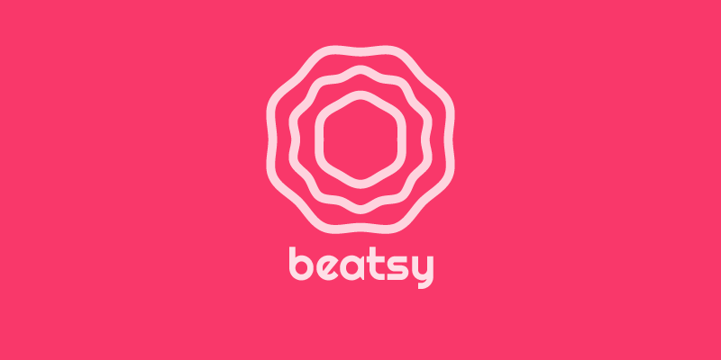
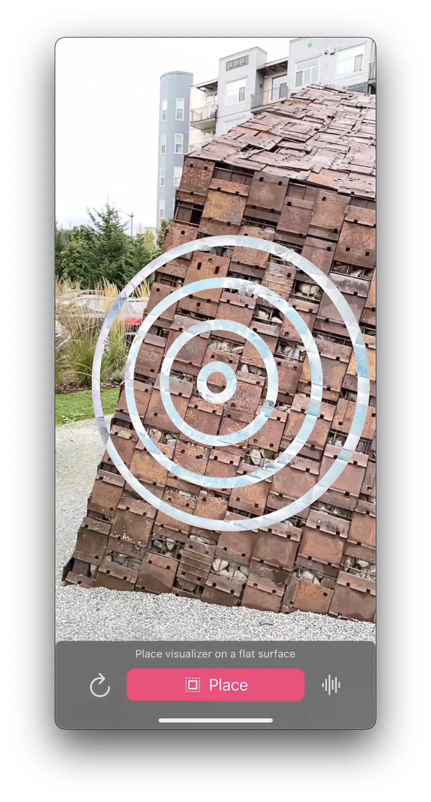
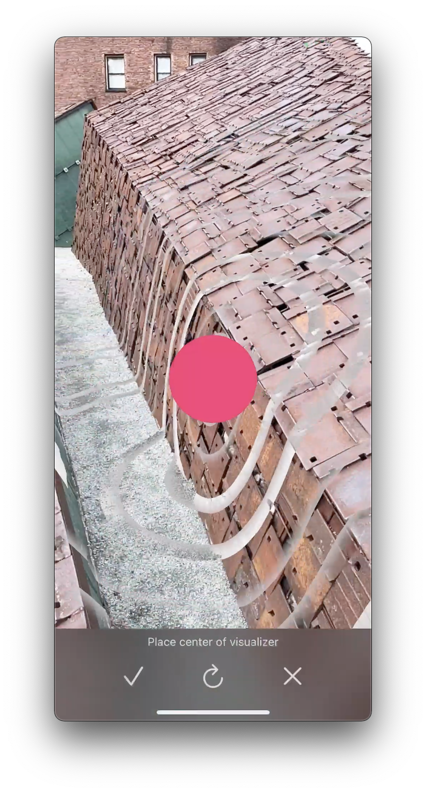
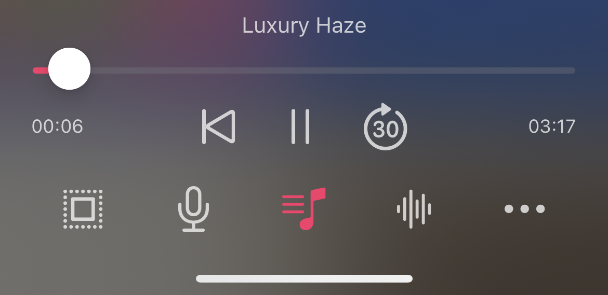
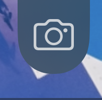
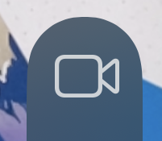
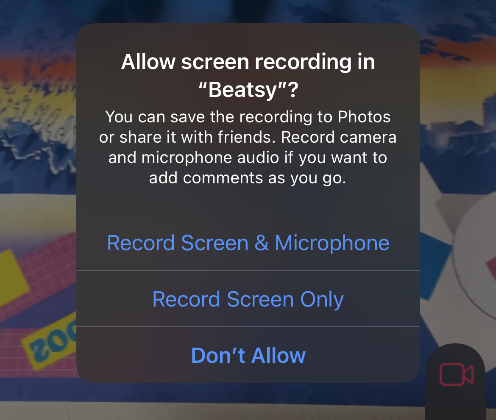

    

    

Beatsy is an augmented reality music visualizer app for iPhone and iPad that lets you transform the world to the beat of your music. The app is [available for free on the App Store][app].

This document covers the basics of using Beatsy. If you run into any issues or have any feature requests, you can also [file an issue][issues] here.

# Using Beatsy

Beatsy's augmented reality music visualizers let you distort the world around you to music from your library or audio from the microphone.

## Placing visualizers

To get started, first you need to place a visualizer in the world. This often means finding a flat horizontal or vertical surface to place it on. The app will walk you through the placement process.

A set of circles shows where the visualizer will be placed.

    

If you don't see this placement preview, it likely means that the app has not yet detected the surface you are looking at. To help with detection:

- Make sure you are trying to place the visualizer on a relatively flat surface. Very rough or holey surfaces may not be detected. 
- Try moving the device around while keeping it aimed at the surface. On devices without a LiDAR sensor, this helps with surface detection.
- Make sure there is enough light for the cameras. Surface detection struggles in low light scenes.
- Use a surface that has some visual details. Surface detection struggles when pointed at solid color surfaces, such as solid white walls.

> 🎵 **Note**: While placing, drag horizontally to rotate the visualizer and pinch to scale it up and down. These controls also work after you have place the visualizer.

Once you are happy with the visualizer's location, press the `Place` button to continue.

### Placing Immersive visualizers

If your device has a LiDAR sensor—such as the iPad pro or the iPhone 12/13 Pro—some of Beatsy's visualizers instead operate in 3D space. These immersive visualizers can be placed anywhere in the world, not just on flat surfaces.

When placing an immersive visualizer, you place the center of the visualizer instead of placing the visualizer on the surface it will distort. The placement position is previewed by a red ball:

    

In general, immersive visualizers can only be placed within 5 meters of your device's current position. This is a limitation of the LiDAR sensor. 

> 🎵 **Note**: Some immersive visualizers work by building up a 3D model of the world around you. This model may be incomplete. To improve the quality of the visualizer effects, pan your phone over any areas of the scene you'd like to distort. You can also try viewing the same part of the scene from different angles to improve the 3D world model.

## Visualizing sound from the microphone

By default, Beatsy visualizes audio from the microphone. This is shown by the red microphone button.

    

Just talk or make sound to see the visualizer kick in.

> 🎵 **Note**: If the microphone is not working, make sure Beatsy has microphone permissions. In the Settings app, search for `Beatsy` and make sure `Microphone` is checked.

You can also use the microphone to visualize audio from other apps playing over the speakers. Beatsy pauses active audio when it launches, but you can resume the audio from control center.

### Visualizing music

To visualize music, tap the center icon with the musical note. This will bring up a music selector.

    

If you instead see an alert title an `Internal Error`, then the Apple Music app is not currently installed on your device. Make sure to reinstall it before trying again.

Beatsy can only visualize songs that you have copied to your device. It does not support streaming music from cloud services such as Apple Music or Spotify. It also cannot visualize music with DRM protection. I know these limitations suck—I even [wrote a whole piece](https://blog.mattbierner.com/the-war-we-forgot/) about why they exist and why they suck—unfortunately I cannot work around them however.

> 🎵 **Note**: You can play streaming music from service such as Spotify over the speaker and use the microphone's input.

> 🎵 **Note**: Services such as [Bandcamp](https://bandcamp.com) offer DRM free music. After purchasing a song, download it and copy it to your device to load it up in Beatsy.

## Customizing the Visualizer

Tap on the wave icon to change the visualizer or edit the settings for the current visualizer. Beatsy currently offers seven built-in visualizers:

- `Ferro` - The default. Inspired by magnetic fluid. Offers a number a customization options.

- `Speaker` — Circular visualizer that distorts the surface using smooth waves. The visual effect is sort of like a giant speaker.

- `Equalizer` — Breaks music up into sections (e.g. bass, mid, treble) and visualizes how the intensity of the music changes over time. 

- `Spectrum` - Simple spectrum visualizer with 3 display modes.

- `Waves` - Sends waves of distortion rippling out from a the center of the visualizer. Support immersive, 3D distortion on devices with a LiDAR sensor.

- `Color Waves` - Sends waves of color rippling out from a the center of the visualizer. These colors can be customized and correspond to the different components of the music (bass, mid, treble). Support immersive, 3D distortion on devices with a LiDAR sensor.

- `Lava Lamp` - Creates blobs of color that respond to the music. These blobs slowly drift upwards. Support immersive, 3D distortion on devices with a LiDAR sensor.

- `Ferro Face` - Applies the `Ferro` shader to your face instead. Includes three different presets.

## Sharing

Tap the camera button on the right side to capture a image of the current visualization.

    

This image hides all UI elements so that you only see the visualizer.

Tap the video button to start recording a video.

    

This will show a prompt asking if you'd also like to record your microphone input in addition to any playing music.

    

Tap the video button again to stop recording.

> 🎵 **Note**: Keep in mind that while you are free to share any content created with Beatsy, music may be subject to copyright. To be safe, make sure to get the copyright holder's permissions before publicly posting videos with music.

After taking a video or image, you can download it to your photos or share it using the standard iOS share sheet. You can also trim videos right in the app.

# Advanced options

## Spatial audio

Tap on the `...` to turn on spatial audio. When spatial audio is enabled, the currently playing song will sound like it is coming from the physical location of the visualizer in the real world. This means:

- Volume will decrease as you move away from the visualizer.
- Smaller visualizers will also be softer than larger ones.
- The direction of sound will change based on your orientation to the visualizer. This requires headphones to hear.

## Foreground occlusion

(Note that foreground occlusion requires a device with a LiDAR sensor, such as the iPhone 12 Pro)

Foreground occlusion uses depth data from the LiDAR sensor to avoid distorting objects that appear in front of the visualizer effects. This foreground object could be a person, your hand, or a wall. The result makes it look like the effect is better integrated into the world instead of merely being an effect on your screen.

To enable foreground occlusion, tap the lightbulb icon and toggle "Foreground Occlusion". Keep in mind that the effect is not perfect. If you don't need it, I suggest turning the feature off.

For best results with foreground occlusion:

- Make sure the visualizer plane is exactly placed on the real world surface. You may notice significant issues if the plane is placed a few cm above or below the real surface. 

- Only enable foreground occlusion if the surface is flat. If the surface is angled or pitted, foreground occlusion may cause weird artifacts.

- Keep in mind that objects only a few cm from the surface will be considered part of the surface. Foreground occlusion works best when there is at least a 25cm difference in depth between the foreground object and the surface (although the margin it uses internally is closer to 15cm). 

- Foreground objects can only be around 4 meter from the phone. This is a limitation of the LiDAR sensor.

# Feedback

Love Beatsy? Be sure to tell your friends about it and share any cool visualizations you create using the app. If you are feeling especially generous, please also write an App Store review. This really helps other people find the app.

Run into a bug or want to request a new feature? Just [file an issue][issues]!

[app]: https://apps.apple.com/us/app/beatsy/id1543162330
[issues]: https://github.com/mattbierner/beatsy-support/issues
